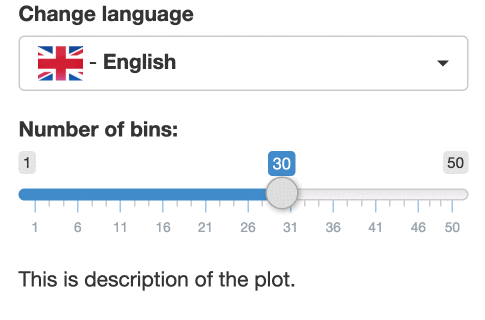

# shiny.i18n <a href="https://appsilon.github.io/shiny.i18n/"></a>

> _Shiny applications internationalization made easy!_

<!-- badges: start -->
[](https://cran.r-project.org/package=shiny.i18n)
[](https://codecov.io/gh/Appsilon/shiny.i18n)
[](https://CRAN.R-project.org/package=shiny.i18n)
[](https://CRAN.R-project.org/package=shiny.i18n)
[](https://github.com/Appsilon/shiny.i18n/actions/workflows/main.yaml)
<!-- badges: end -->

Using it is very simple: just prepare your translation files in one of the supported formats, read them into your app using user-friendly **shiny.i18n** interface and surround your expressions to translate by a translator tag. Thanks to that your app will remain neat and readable.

*Actually, you can use **shiny.i18n** as a standalone R package - shiny app is just a perfect use-case example.*

Change languages and formats easy with **shiny.i18n**.

## How to install?

Stable version:

```r
install.packages("shiny.i18n")
```

Development version:

```r
remotes::install_github("Appsilon/shiny.i18n")
```

## Examples



<center>
<h3>
<a href="https://connect.appsilon.com/i18n/">See shiny.i18n in action live</a>
</h3>
</center>

You can find some basic examples in `examples` folder:

1) Using i18n object with [CSV translation files](https://github.com/Appsilon/shiny.i18n/blob/master/examples/basic/app_csv.R) or [JSON translation files](https://github.com/Appsilon/shiny.i18n/blob/master/examples/basic/app_json.R).

2) Live language change on the [browser side](https://github.com/Appsilon/shiny.i18n/blob/master/examples/live_language_change/browser_app.R) or with the server [function renderUI](https://github.com/Appsilon/shiny.i18n/blob/master/examples/live_language_change/server_app.R).

3) [RMarkdown translations](https://github.com/Appsilon/shiny.i18n/blob/master/examples/rmarkdown/report.Rmd).

4) Example of translation [data format](https://github.com/Appsilon/shiny.i18n/tree/master/examples/data).

#### Translation file format

Currently **shiny.i18n** supports two translation formats:

-   **csv** - where each translation is in separate file `translation_<LANGUAGE-CODE>.csv` containing two columns: key translation, language to which it needs to be translated. Example of `translation_pl.csv` for Polish language you may find here: `inst/examples/data/translation_pl.csv`. You load the data by passing the path to folder containing all the csv files:

```r
Translator$new(translation_csvs_path = "...")
```

-   **json** - single json file `translation.json` with mandatory fields: `"languages"` with list of all language codes and `"translation"` with list of dictionaries assigning each translation to a language code. Example of such a json file for Polish language you may find here: `inst/examples/data/translation.json`. You load the data by passing the path to json file.

```r
Translator$new(translation_json_path = "...")
```

## How to contribute?

If you want to contribute to this project please submit a regular PR, once you're done with a new feature or bug fix.

Reporting a bug is also helpful - please use [GitHub issues](https://github.com/Appsilon/shiny.i18n/issues) and describe your problem as detailed as possible.

## Appsilon


Appsilon is a **Posit (formerly RStudio) Full Service Certified Partner**.<br/>
Learn more
at [appsilon.com](https://appsilon.com).

Get in touch [opensource@appsilon.com](opensource@appsilon.com)

Check our [Open Source tools](https://shiny.tools).

<a href = "https://appsilon.com/careers/" target="_blank"></a>
