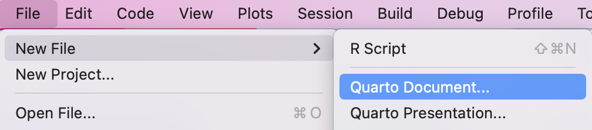
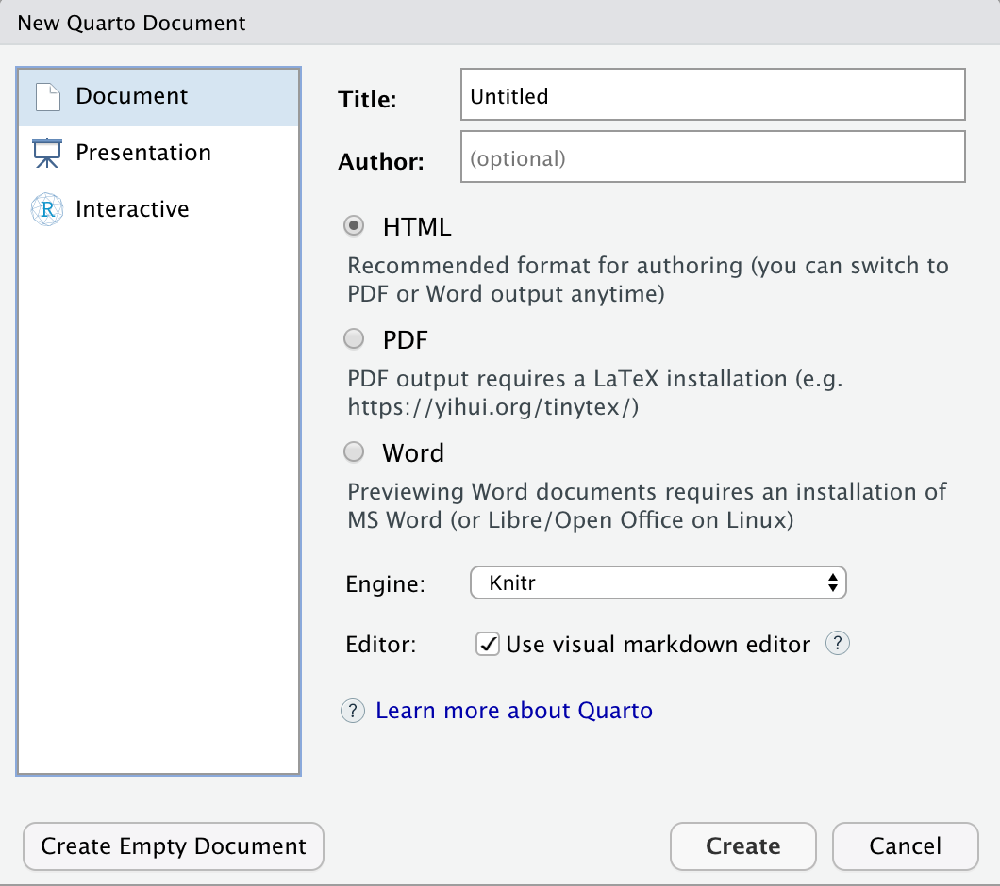
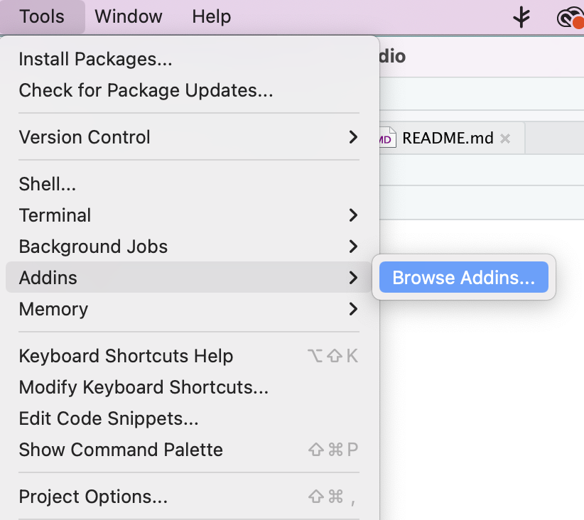
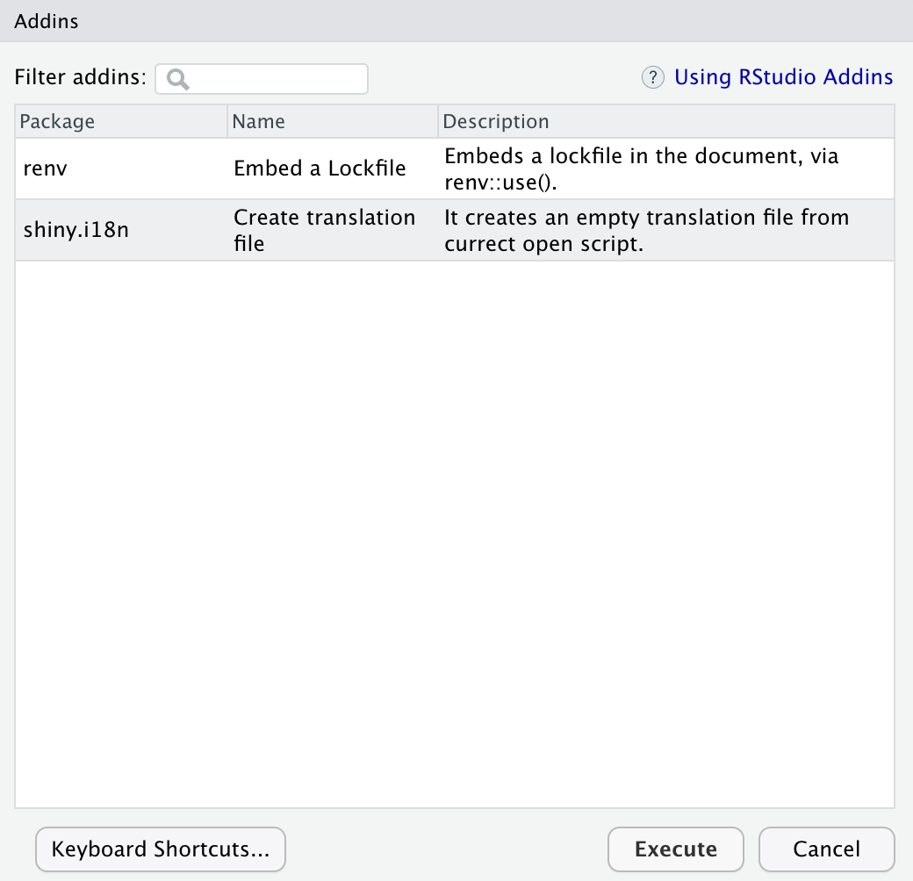

```{r setup, include = FALSE, screenshot.force = FALSE}
library(shiny)
library(shiny.i18n)
library(quarto)
```

In this tutorial, we will integrate `shiny.i18n` in a {quarto} document or a `.qmd` file. Before continuing, we recommend you follow through with the [basics](https://appsilon.github.io/shiny.i18n/articles/basics.html) of `shiny.i18n`, if you haven't already. Once you are equipped with the basics and setting up a translation file, this tutorial will be easier to follow.

## Creating a Quarto Document

To create a Quarto Document, you can simply go to `File` -> `New File` and select `Quarto Document`



This will bring up the document selection screen. You can choose between several options such as,

- Document
- Presentation
- Interactive

For the purpose of this tutorial, we'll go through with an HTML Document.



## Let's Translate

If you have followed the tutorial mentioned in the introduction, you should be able to set up a `Translator` object as follows.

### Setting Up

```r
library(shiny.i18n)
i18n <- Translator$new(translation_json_path = "translation.json")
```

The `translation.json` file will look something like the following format.

```json
{
  "languages": [
    "key",
    "en",
    "pl"
  ],
  "translation": [
    {
      "key": "language_code",
      "en": "English",
      "pl": "Polish"
    },
    {
      "key": "hello",
      "en": "Hello world!",
      "pl": "Witaj świecie!"
    }
    ]
}
```

You can make it simpler by removing the `"key"` elements. In that case, the first language in the list will become the designated `key`.

**Pro-tip:** You can also use our Addin after setting up the translated objects to automatically detect each place where `$t` or `$translate` is used and add that to a `translation.json` file to make your job easier.

First, you click the `Tools` -> `Addins` -> `Browse Addins...` option



Then, you select the `shiny.i18n` addin from the list and click `Execute`.



### Translating

To translate, you first need to set a translation language in an `r` code chunk to make sure it executes.

```r
i18n$set_translation_language("pl")
```

Then, you can simply use the translated text inline using a similar structure as below in between a pair of single backticks `"``"`

```md
r { i18n$t("hello") }
```

You can use the text as you want, such as in headings, by simply following the appropriate Markdown structure.

```md
## r { i18n$t("hello") }
```

And voila! It does not get more straightforward than this! That is how simply and easily `shiny.i18n` works with Quarto. No extra steps required.

## Further Reading

For a full example, you can check out the `examples/quarto` directory in the [GitHub repository](https://github.com/Appsilon/shiny.i18n/tree/master/examples/quarto). The example walks through setting up a simple document and then, using `shiny.i18n` to translate certain parts of it.
