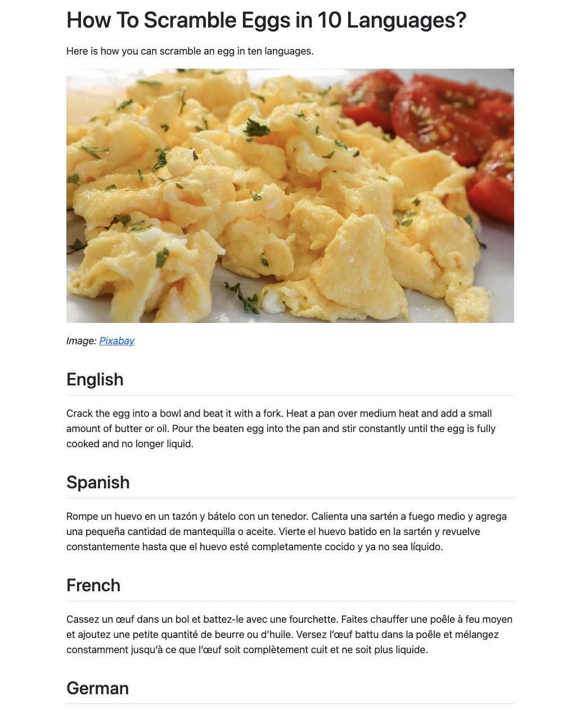

```{r setup, include = FALSE, screenshot.force = FALSE}
library(shiny)
library(shiny.i18n)
library(quarto)
```

In this tutorial, we will integrate `shiny.i18n` in a {quarto} document or a `.qmd` file.

To get started, make sure you have Quarto set up through one of the several options provided on Quarto's [Get Started](https://quarto.org/docs/get-started/) page.

Also, please make sure you have gone through the [basics](https://appsilon.github.io/shiny.i18n/articles/basics.html) once.

Now, we can dive into what we will be building.

For the context of this tutorial, we are going to build a document like the following screenshot. To view the full thing as `.html`, you can go [here](https://github.com/Appsilon/shiny.i18n/tree/master/examples/quarto_tutorial/quarto_shinyi18n.html). For an example `.qmd` to follow along, you can also go [here](https://github.com/Appsilon/shiny.i18n/tree/master/examples/quarto_tutorial/quarto_shinyi18n.qmd)



**All set?** Let's begin!

First, we need to make sure we have the library installed.

```r
install.packages("shiny.i18n")
```

Great, now we begin setting up our `.qmd` file. The beginning will be pre-filled for us but in case it is not, we need to first set a document title and the opening sentence.

```md
---
title: "How To Scramble Eggs in 10 Languages?"
---

Here is how you can scramble an egg in ten languages.

```

Next, we need the header image, which you can get as a free to use image from [Pixabay](https://pixabay.com/photos/scrambled-eggs-eggs-breakfast-food-6582990/).

Let's call it `eggs.jpg` and place it in the same directory as a our `.qmd` file.

```md
{width=100%}

_Image:_ [_Pixabay_](https://pixabay.com/photos/scrambled-eggs-eggs-breakfast-food-6582990/)
```

The above code will get you set up with an image that fills the entire width of the document as well as credit to the original source of the image.

### Loading `shiny.i18n`

Now, we move onto the good stuff which is setting up `shiny.i18n`.

```r
library(shiny.i18n)

i18n <- Translator$new(translation_json_path = "translation.json")
```

We load the library and set up a `Translator` object using a `translation.json` file.

### Setting Up `translation.json`

The idea for `shiny.i18n`, as given in the `Introduction to shiny.i18n` tutorial linked earlier is that we use a key-value mechanism to switch between languages through a `Translator` object.

One way is to have the first language serve both as a language and as a key. In that case, we would set up our `translation.json` as the following.

```json
{
  "cultural_date_format": "%d-%m-%Y",
  "languages": [
    "en",
    "es",
    "fr"
  ],
  "translation": [
    {
      "en": "ENGLISH_TEXT",
      "es": "SPANISH_TEXT",
      "fr": "FRENCH_TEXT"
    }
  ]
}
```

Here, `en` is both the default key as well as a language. An alternative, which we will use here is to have the first element as a literal key for each string.

```json
{
  "cultural_date_format": "%d-%m-%Y",
  "languages": [
    "key",
    "en",
    "es",
    "fr"
  ],
  "translation": [
    {
      "key": "key_name",
      "en": "ENGLISH_TEXT",
      "es": "SPANISH_TEXT",
      "fr": "FRENCH_TEXT"
    }
  ]
}
```

**Tip:** If you are in an RStudio environment, you can also use our `Addin` which is automatically available when you install and activate the package. All you have to do is go to `Tools -> Addins -> Browse Addins...` and select the `shiny.i18n` Addin which will auto-detect all places where `$t` or `$translate` is used.

But for now, we do not need any such thing. We can simply set up the `translation.json` file ourselves.

```json
{
  "cultural_date_format": "%d-%m-%Y",
  "languages": [
    "key",
    "en",
    "es",
    "fr",
    "de",
    "it",
    "pt",
    "ja",
    "sv",
    "pl",
    "hi"
  ],
  "translation": [
    {
      "key": "language_name",
      "en": "English",
      "es": "Spanish",
      "fr": "French",
      "de": "German",
      "it": "Italian",
      "pt": "Portuguese",
      "ja": "Japanese",
      "sv": "Swedish",
      "pl": "Polish",
      "hi": "Hindi"
    },
    {
      "key": "method",
      "en": "Crack the egg into a bowl and beat it with a fork. Heat a pan over medium heat and add a small amount of butter or oil. Pour the beaten egg into the pan and stir constantly until the egg is fully cooked and no longer liquid.",
      "es": "Rompe un huevo en un tazón y bátelo con un tenedor. Calienta una sartén a fuego medio y agrega una pequeña cantidad de mantequilla o aceite. Vierte el huevo batido en la sartén y revuelve constantemente hasta que el huevo esté completamente cocido y ya no sea líquido.",
      "fr": "Cassez un œuf dans un bol et battez-le avec une fourchette. Faites chauffer une poêle à feu moyen et ajoutez une petite quantité de beurre ou d'huile. Versez l'œuf battu dans la poêle et mélangez constamment jusqu'à ce que l'œuf soit complètement cuit et ne soit plus liquide.",
      "de": "Schlage ein Ei in einer Schüssel auf und verquirle es mit einer Gabel. Erhitze eine kleine Menge Butter oder ein wenig Öl in einer Pfanne bei mittlerer Hitze und gieße das aufgeschlagene Ei in die Pfanne. Rühre solange bis das Ei stockt wird und nicht mehr flüssig ist.",
      "it": "Rompi un uovo in una ciotola e sbattilo con una forchetta. Scalda una padella a fuoco medio e aggiungi una piccola quantità di burro o olio. Versa l'uovo sbattuto nella padella e mescola costantemente finché l'uovo non è completamente cotto e non è più liquido.",
      "pt": "Quebre o ovo em uma tigela e bata com um garfo. Aqueça uma panela em fogo médio e adicione uma pequena quantidade de manteiga ou óleo. Despeje o ovo batido na panela e mexa constantemente até que o ovo esteja totalmente cozido e não mais líquido.",
      "ja": "ボウルに卵を割り入れ、箸で溶きほぐす。フライパンを中火に熱して、少量バター又はオイルを入れる。卵を入れ、完全に焼けるまで混ぜ続ける。",
      "sv": "Knäck ägget i en skål och vispa det med en gaffel. Hetta upp en panna på medelvärme och tillsätt en liten mängd smör eller olja. Häll det uppvispade ägget i pannan och rör hela tiden tills ägget är helt genomkokt och inte längre flytande.",
      "pl": "Rozbij jajko do miski i roztrzep je za pomocą widelca. Rozgrzej patelnię na średnim ogniu i dodaj niewielką ilość masła lub oleju. Wlej roztrzepane jajko na patelnię i mieszaj ciągle aż jajko całkowicie się zetnie i nie będzie już płynne.",
      "hi": "एक बोल में एक अंडा तोड़कर फोर्क से मिलाएँ। मध्यम ऊर्जा पर पैन गरम करें और थोड़ा मक्खन या तेल डालें। मिलाये हुवे अंडे को पैन में डालें और अंडा पूरी तरह रह से पकने तक हिलाएँ।"
    }
   ]
}
```

Once this is set up and saved in the same directory, our `Translator` object will be created without any issues.

## Using Translations

One crucial thing to understand here is that we will use the following syntax to translate into a particular language.

```r
translator_object$set_translation_language(LANGUAGE)
translator_object$t(KEY)
```

In our case, if we were to get the method for scrambling eggs in English, this would look like the following.

```r
i18n$set_translation_language("en")
i18n$t("method")
```

In markdown files, if we want to use `R` code inline, we can only use it by wrapping it in curly braces `"r { CODE HERE }"` and having two lines of code will make it a bit unclear to read. Let's create a function.

### Making It Cleaner

```r
get_translation <- function(translator_object, language_code, content_key) {
  translator_object$set_translation_language(language_code)
  translator_object$t(content_key)
}
```

The `get_translation()` function makes the work simple for us. Let's combine everything together and you should have the following code chunk.

````{verbatim}
{r include=FALSE}

library(shiny.i18n)

i18n <- Translator$new(translation_json_path = "translation.json")

get_translation <- function(translator_object, language_code, content_key) {
  translator_object$set_translation_language(language_code)
  translator_object$t(content_key)
}

````

The `include=FALSE` makes sure our code is not visible in the document but executes by default. For making an explicit evaluation of the code, we can also add `eval=TRUE` but it is not necessary in most cases.

Now, to include the language name as well as the method, we use something like this.

````{verbatim}
## `r { get_translation(i18n, "en", "language_name") }`

`r { get_translation(i18n, "en", "method") }`
````

This sets up an H2 Heading as well as the text that follows it. Here, we are setting it up for English. For all languages, it would look something like this.

````{verbatim}
 ## `r { get_translation(i18n, "en", "language_name") }`

`r { get_translation(i18n, "en", "method") }`

## `r { get_translation(i18n, "es", "language_name") }`

`r { get_translation(i18n, "es", "method") }`

## `r { get_translation(i18n, "fr", "language_name") }`

`r { get_translation(i18n, "fr", "method") }`

## `r { get_translation(i18n, "de", "language_name") }`

`r { get_translation(i18n, "de", "method") }`

## `r { get_translation(i18n, "it", "language_name") }`

`r { get_translation(i18n, "it", "method") }`

## `r { get_translation(i18n, "zh", "language_name") }`

`r { get_translation(i18n, "zh", "method") }`

## `r { get_translation(i18n, "ja", "language_name") }`

`r { get_translation(i18n, "ja", "method") }`

## `r { get_translation(i18n, "ko", "language_name") }`

`r { get_translation(i18n, "ko", "method") }`

## `r { get_translation(i18n, "pl", "language_name") }`

`r { get_translation(i18n, "pl", "method") }`

## `r { get_translation(i18n, "hi", "language_name") }`

`r { get_translation(i18n, "hi", "method") }`
````

**Simple, isn't it!?** That's all we have to do for the `shiny.i18n` side of things. Now, let's wrap this up with a conclusion.

```md
## Get Scrambling

This little guide was a demonstration of how you can use `shiny.i18n` with Quarto to create a document in multiple languages. And what's more, you now know how to scramble eggs! You can view the full tutorial [here](https://appsilon.github.io/shiny.i18n/articles/quarto.html)
```

## Conclusion 

And voila! Scrambled and served. You should now be able to render the Quarto document and it should look like the article in the screenshot or like [this](https://github.com/Appsilon/shiny.i18n/tree/master/examples/quarto_tutorial/quarto_shinyi18n.html).

Hope this tutorial helped you set up a Quarto document while leveraging `shiny.i18n`.
