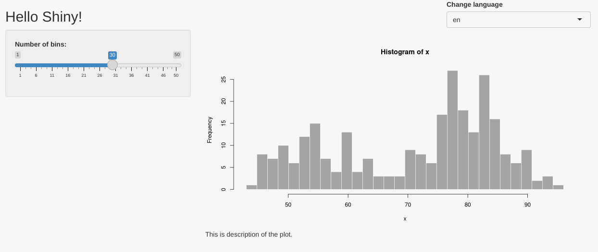

# Introduction

This tutorial shows an easy way of implementing internationalization in a Shiny application
built using [Rhino framework](https://appsilon.github.io/rhino/).
The goal is to recreate a simple app that can be [found in the
examples](https://github.com/Appsilon/shiny.i18n/blob/master/examples/live_language_change/browser_app.R), but with the Rhino setup.

# Setup Rhino application

The first step is to create a Rhino application.
Before that, make sure that you have `rhino` installed:

```r
install.packages("rhino")
```

Now, initialize a new Rhino application. You can do it either by using RStudio Wizard
or a function `rhino::init("rhino_i18n")`.
More details on how to create a Rhino app can be found in the [Rhino tutorial](https://appsilon.github.io/rhino/articles/tutorial/create-your-first-rhino-app.html#create-an-initial-application).

After initializing the application, the next step is to install `shiny.i18n` and add it to the dependencies.

In the R console run:
```r
install.packages("shiny.i18n")
```

After that, modify `dependencies.R` file:

```r
# dependencies.R

library(rhino)
library(shiny.i18n)
```

And update `renv.lock` by running in the R console:

```r
renv::snapshot()
```

# Build a basic application

The next step is to fill out the application with the content.
We will use the example application that can be [found in the
examples](https://github.com/Appsilon/shiny.i18n/blob/master/examples/live_language_change/browser_app.R).

## Initial application

First, let's implement the basic version of the app (without internationalization).
Modify `app/main.R` in the following way:

```r
# app/main.R

box::use(
  shiny,
  graphics[hist],
)

#' @export
ui <- function(id) {
  ns <- shiny$NS(id)
  shiny$fluidPage(
    shiny$div(
      style = "float: right;",
      shiny$selectInput(
        ns("selected_language"),
        "Change language",
        choices = c("en", "pl", "it")
      )
    ),
    shiny$titlePanel("Hello Shiny!", windowTitle = NULL),
    shiny$sidebarLayout(
      shiny$sidebarPanel(
        shiny$sliderInput(
          ns("bins"),
          "Number of bins:",
          min = 1,
          max = 50,
          value = 30
        )
      ),
      shiny$mainPanel(
        shiny$plotOutput(ns("distPlot")),
        shiny$p("This is description of the plot.")
      )
    )
  )
}

#' @export
server <- function(id) {
  shiny$moduleServer(id, function(input, output, session) {
    output$distPlot <- shiny$renderPlot({
      x <- datasets::faithful[, 2]
      bins <- seq(min(x), max(x), length.out = input$bins + 1)
      hist(
        x,
        breaks = bins,
        col = "darkgray",
        border = "white",
        main = "Histogram of x",
        ylab = "Frequency"
      )
    })
  })
}
```

If you run it with `shiny::runApp()` you will see a slightly modified version
of the "Old Faithful Geyser Data" app.

<div class="app-preview">
  
</div>

## Add translator

The next step is to add an instance of `shiny.i18n::Translator` class and provide the translations.
In `shiny.i18n`, translations can be added as CSV or JSON files - we will use the latter.
Create `app/translations` directory, and inside add `translations.json` file:

```json
{
  "languages": ["en", "pl", "it"],
  "translation": [
      {
        "en": "Hello Shiny!",
        "pl": "Witaj Shiny!",
        "it": "Ciao Shiny!"
      },
      {
        "en": "Number of bins:",
        "pl": "Liczba podziałek:",
        "it": "Numero di intervalli"
      },
      {
        "en": "This is description of the plot.",
        "pl": "To jest opis obrazka.",
        "it": "Questa è la descrizione della grafico."
      },
      {
        "en": "Histogram of x",
        "pl": "Histogram x",
        "it": "Istogramma di x"
      },
      {
        "en": "Frequency",
        "pl": "Częstotliwość",
        "it": "Frequenza"
      },
      {
        "en": "Change language",
        "pl": "Wybierz język",
        "it": "Cambia lingua"
      }
    ]
}
```

Now, we need to create a Translator and pass the path to the translation file.
In the `app/main.R` file add:

```r
# app/main.R

box::use(
  shiny,
  graphics[hist],
  shiny.i18n[Translator],
)

i18n <- Translator$new(translation_json_path = "app/translations/translations.json")

#' @export
ui <- function(id) {

...
```

The next step is to choose the default translation language:

```r
# app/main.R

box::use(
  shiny,
  graphics[hist],
  shiny.i18n[Translator],
)

i18n <- Translator$new(translation_json_path = "app/translations/translations.json")
i18n$set_translation_language("en")

#' @export
ui <- function(id) {

...
```
## Translate UI elements

Now we are ready to start plugging the translator into the application.
First, the language selection input should use languages available in the translator
and start with the default language selected.

```r
# app/main.R

box::use(
  shiny,
  graphics[hist],
  shiny.i18n[Translator],
)

i18n <- Translator$new(translation_json_path = "app/translations/translations.json")
i18n$set_translation_language("en")

#' @export
ui <- function(id) {
  ns <- shiny$NS(id)
  shiny$fluidPage(
    shiny$div(
      style = "float: right;",
      shiny$selectInput(
        ns("selected_language"),
        "Change language",
        choices = i18n$get_languages(),
        selected = i18n$get_key_translation()
      )
    ),
    shiny$titlePanel("Hello Shiny!", windowTitle = NULL),

...
```

We also need to add `shiny.i18n` dependencies and add the translator to the UI
by calling `usei18n()`:

```r
# app/main.R

box::use(
  shiny,
  graphics[hist],
  shiny.i18n[Translator, usei18n],
)

i18n <- Translator$new(translation_json_path = "app/translations/translations.json")
i18n$set_translation_language("en")

#' @export
ui <- function(id) {
  ns <- shiny$NS(id)
  shiny$fluidPage(
    usei18n(i18n),
    shiny$div(
      style = "float: right;",
      shiny$selectInput(
        ns("selected_language"),
        "Change language",
        choices = i18n$get_languages(),
        selected = i18n$get_key_translation()
      )
    ),

...
```

We still miss the connection between the select input and the translation language change.
To achieve that, we will use an `observeEvent` with `shiny.i18n::update_lang` function:

```r
# app/main.R

box::use(
  shiny,
  graphics[hist],
  shiny.i18n[Translator, usei18n, update_lang],
)

i18n <- Translator$new(translation_json_path = "app/translations/translations.json")
i18n$set_translation_language("en")

#' @export
ui <- function(id) {
  ns <- shiny$NS(id)
  shiny$fluidPage(
    usei18n(i18n),
    shiny$div(
      style = "float: right;",
      shiny$selectInput(
        ns("selected_language"),
        "Change language",
        choices = i18n$get_languages(),
        selected = i18n$get_key_translation()
      )
    ),
    shiny$titlePanel("Hello Shiny!", windowTitle = NULL),
    shiny$sidebarLayout(
      shiny$sidebarPanel(
        shiny$sliderInput(
          ns("bins"),
          "Number of bins:",
          min = 1,
          max = 50,
          value = 30
        )
      ),
      shiny$mainPanel(
        shiny$plotOutput(ns("distPlot")),
        shiny$p("This is description of the plot.")
      )
    )
  )
}

#' @export
server <- function(id) {
  shiny$moduleServer(id, function(input, output, session) {
    shiny$observeEvent(input$selected_language, {
      update_lang(input$selected_language)
    })

    output$distPlot <- shiny$renderPlot({
      x <- datasets::faithful[, 2]
      bins <- seq(min(x), max(x), length.out = input$bins + 1)
      hist(
        x,
        breaks = bins,
        col = "darkgray",
        border = "white",
        main = "Histogram of x",
        ylab = "Frequency"
      )
    })
  })
}
```

The next step is to translate text in the UI part of the application.
To do that, simply wrap text in `i18n$translate()` method:

```r
# app/main.R

box::use(
  shiny,
  graphics[hist],
  shiny.i18n[Translator, usei18n, update_lang],
)

i18n <- Translator$new(translation_json_path = "app/translations/translations.json")
i18n$set_translation_language("en")

#' @export
ui <- function(id) {
  ns <- shiny$NS(id)
  shiny$fluidPage(
    usei18n(i18n),
    shiny$div(
      style = "float: right;",
      shiny$selectInput(
        ns("selected_language"),
        i18n$translate("Change language"),
        choices = i18n$get_languages(),
        selected = i18n$get_key_translation()
      )
    ),
    shiny$titlePanel(i18n$translate("Hello Shiny!"), windowTitle = NULL),
    shiny$sidebarLayout(
      shiny$sidebarPanel(
        shiny$sliderInput(
          ns("bins"),
          i18n$translate("Number of bins:"),
          min = 1,
          max = 50,
          value = 30
        )
      ),
      shiny$mainPanel(
        shiny$plotOutput(ns("distPlot")),
        shiny$p(i18n$translate("This is description of the plot."))
      )
    )
  )
}

...
```

If you now run the app, you will see that changing the language updates
application text with the proper translation:

<div class="app-preview">
  
</div>

## Translate the server part

The only missing part is the plot - the title and y-axis label.
The text there is rendered in the server, so we need to add the translator there:

```r
# app/main.R

box::use(
  shiny,
  graphics[hist],
  shiny.i18n[Translator, usei18n, update_lang],
)

i18n <- Translator$new(translation_json_path = "app/translations/translations.json")
i18n$set_translation_language("en")

#' @export
ui <- function(id) {
  ns <- shiny$NS(id)
  shiny$fluidPage(
    usei18n(i18n),
    shiny$div(
      style = "float: right;",
      shiny$selectInput(
        ns("selected_language"),
        i18n$translate("Change language"),
        choices = i18n$get_languages(),
        selected = i18n$get_key_translation()
      )
    ),
    shiny$titlePanel(i18n$translate("Hello Shiny!"), windowTitle = NULL),
    shiny$sidebarLayout(
      shiny$sidebarPanel(
        shiny$sliderInput(
          ns("bins"),
          i18n$translate("Number of bins:"),
          min = 1,
          max = 50,
          value = 30
        )
      ),
      shiny$mainPanel(
        shiny$plotOutput(ns("distPlot")),
        shiny$p(i18n$translate("This is description of the plot."))
      )
    )
  )
}

#' @export
server <- function(id) {
  shiny$moduleServer(id, function(input, output, session) {
    shiny$observeEvent(input$selected_language, {
      update_lang(input$selected_language)
    })

    output$distPlot <- shiny$renderPlot({
      x <- datasets::faithful[, 2]
      bins <- seq(min(x), max(x), length.out = input$bins + 1)
      hist(
        x,
        breaks = bins,
        col = "darkgray",
        border = "white",
        main = i18n$translate("Histogram of x"),
        ylab = i18n$translate("Frequency")
      )
    })
  })
}
```
Now, if you run the application, everything should work:

<div class="app-preview">
  
</div>

# Add inner module

A Rhino application is usually built using multiple Shiny modules.
You can learn more about the Rhino structure from [this article](https://appsilon.github.io/rhino/articles/explanation/application-structure.html).
In this section, we are going to show how the translator can be used in such a setup,
by moving the main panel into a separate module.

First, create a new R file `app/view/main_panel.R`:

```r
# app/view/main_panel.R

box::use(
  shiny,
)

#' @export
ui <- function(id) {
  ns <- shiny$NS(id)

}

#' @export
server <- function(id) {
  shiny$moduleServer(id, function(input, output, session) {

  })
}
```

Now, let's move the main panel from `app/main.R` into `app/view/main_panel.R`:

```r
# app/view/main_panel.R

box::use(
  shiny,
  graphics[hist],
)

#' @export
ui <- function(id, i18n) {
  ns <- shiny$NS(id)

  shiny$mainPanel(
    shiny$plotOutput(ns("distPlot")),
    shiny$p(i18n$translate("This is description of the plot."))
  )
}

#' @export
server <- function(id, bins, i18n) {
  shiny$moduleServer(id, function(input, output, session) {
    output$distPlot <- shiny$renderPlot({
      x <- datasets::faithful[, 2]
      bins <- seq(min(x), max(x), length.out = bins() + 1)
      hist(
        x,
        breaks = bins,
        col = "darkgray",
        border = "white",
        main = i18n$translate("Histogram of x"),
        ylab = i18n$translate("Frequency")
      )
    })
  })
}
```

The important part to notice here is that the Translator (`i18n` object) needs
to be passed as an argument to the inner module.

The next step is to call the main panel module in the `app/main.R` file:

```r
# app/main.R

box::use(
  shiny,
  shiny.i18n[Translator, usei18n, update_lang],
)

box::use(
  app/view/main_panel
)

i18n <- Translator$new(translation_json_path = "app/translations/translations.json")
i18n$set_translation_language("en")

#' @export
ui <- function(id) {
  ns <- shiny$NS(id)
  shiny$fluidPage(
    usei18n(i18n),
    shiny$div(
      style = "float: right;",
      shiny$selectInput(
        ns("selected_language"),
        i18n$translate("Change language"),
        choices = i18n$get_languages(),
        selected = i18n$get_key_translation()
      )
    ),
    shiny$titlePanel(i18n$translate("Hello Shiny!"), windowTitle = NULL),
    shiny$sidebarLayout(
      shiny$sidebarPanel(
        shiny$sliderInput(
          ns("bins"),
          i18n$translate("Number of bins:"),
          min = 1,
          max = 50,
          value = 30
        )
      ),
      main_panel$ui(ns("main_panel"), i18n = i18n)
    )
  )
}

#' @export
server <- function(id) {
  shiny$moduleServer(id, function(input, output, session) {
    shiny$observeEvent(input$selected_language, {
      update_lang(input$selected_language)
    })

    main_panel$server("main_panel", bins = shiny$reactive(input$bins), i18n = i18n)
  })
}
```

If you now run the application, it should look and behave as previously.
The translation mechanism works, but the application code is now better structured.

<div class="app-preview">
  
</div>

----

**Congratulations! You now have a fully armed and operational ~~battle station~~ multilingual Rhino application!**
