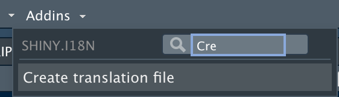

In `shiny.i18n` we use unique translation file formats. We offer two options.
If you prefer keeping all your translations in one place, then **json** file is
designed for you. More often, you send the text of UI of your app to various
translators specializing in different languages. For that use-case we prepared
**csv** format. Let see how they work.

## JSON

Let's see an example of JSON translation file:

```
{
  "languages": ["en", "pl"],
  "translation": [
      {"en": "Hello Shiny!", "pl": "Witaj Shiny!"},
      {
        "en": "Frequency",
        "pl": "Częstotliwość"
      }
    ],
  "cultural_date_format": "%d-%m-%Y"
}
```

The file requires two mandatory fields: `"languages"` and `"translation"`.

`"languages"` contains the list of languages codes. For example we could call English: "engl",
but we decided to keep it shorter.

The order of the code here is **IMPORTANT**.
The first language in `"languages"` list is so-called **key translation**, so the text
that you use to create your Shiny app and query for other translation.
For example, here the content of our Shiny app would look like this:

```{r echo = T, include = T, eval = FALSE}
i18n$t("Hello Shiny!")
```

because the position of "en" in `"languages"` defines it as the **key translation**.

Then, in `"translation"` you need to put a list of dictionaries. Each dictionary maps the language
code to the text in that language.

Other parameters are optional: "cultural_date_format", "cultural_bignumer_mark", "cultural_punctuation_mark".

You can load JSON file by passing its path as `translation_json_path` argument to `Translator`.

```{r echo = T, include = T, eval = FALSE}
i18n <- Translator$new(translation_json_path = "translation.json")
```


## CSV

Again, let's start by looking at the example of **translation_it.csv**.

```
en,it
Hello Shiny!,Ciao Shiny!
Frequency, Frequenza
```

Here, the name of the file is important It **has to have** the prefix: `translation_`,
which is followed by a language code.

Note that CSV typically consists of two columns. The left column is a **key translation** with its code in header.
The right one is a target translation with its code as a column name. The code needs to match the csv file name.

With all that in mind, let's see how to create another CSV file. For [Klingon](https://en.wikipedia.org/wiki/Klingon_language) it would look like this:

**translation_kling.csv**
```
en,kling
Hello Shiny!,bIpIv'a' Shiny!
Frequency,chaDvay'
```

Just remember to follow above-mentioned pattern and keep all the files in the same directory.

You can load CSV files by passing path to folder containing them as `translation_csvs_path` argument to `Translator`. This will automatically detect all files with the pattern: `translation_*.csv`, for example:
`translation_it.csv` for Italian, `translation_kling.csv` for Klingon and so on.

```{r echo = T, include = T, eval = FALSE}
i18n <- Translator$new(translation_csvs_path = "translation_data/")
```

If you want to set extra options (like : "cultural_date_format", etc.) just create
simple *yaml* file and pass it as `translation_csv_config` argument to `Translator`.

## Addin

For your convenience we introduced the addin that builds a demo translation
file for you. It detect all places in your code wrapped with tag: `i18n$t` or
`i18n$translate`.

Just go to your "Addins" menu in *RStudio*.



For more customized tags detection use `create_translation_file` function.
